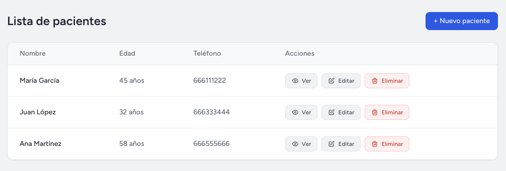
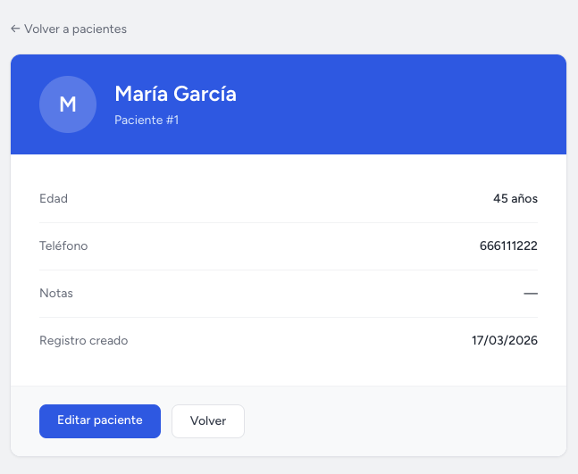
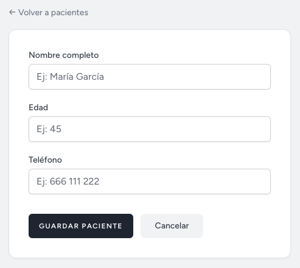
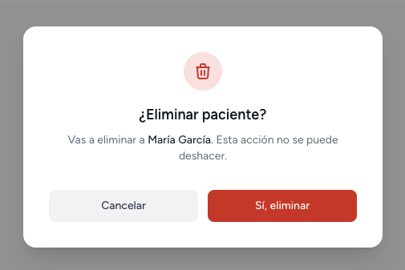

# Gestión Médica — Laravel CRUD App

A full-stack web application for managing medical center patients, built with Laravel 12 and Tailwind CSS.

🔗 **Live demo:** _coming soon_

---

## Features

- **Patient management** — full CRUD: create, view, edit and delete patients
- **Patient detail page** — individual profile with all patient data
- **Form validation** — server-side validation with inline error messages
- **Flash messages** — success confirmations after every action
- **Confirmation modal** — elegant delete confirmation dialog (no browser alerts)
- **Authentication** — login, register and profile management via Laravel Breeze
- **Responsive design** — clean UI built with Tailwind CSS

---

## Tech stack

| Layer | Technology |
|---|---|
| Framework | Laravel 12 |
| Frontend | Blade templates, Tailwind CSS, Vite |
| Auth | Laravel Breeze |
| Database | SQLite (dev) |
| Language | PHP 8.5 |

---

## Screenshots

### Patient list


### Patient detail


### New patient form


### Delete confirmation modal


---

## Running locally

```bash
# Clone the repo
git clone https://github.com/domin10/gestion-medica.git
cd gestion-medica

# Install PHP dependencies
composer install

# Install JS dependencies
npm install

# Set up environment
cp .env.example .env
php artisan key:generate

# Run migrations
php artisan migrate

# Start the dev server (two terminals)
php artisan serve
npm run dev
```

Then open [http://127.0.0.1:8000](http://127.0.0.1:8000) and register an account.

---

## Project structure

```
app/
├── Http/Controllers/
│   └── PacienteController.php   # CRUD logic
└── Models/
    └── Paciente.php              # Eloquent model

database/migrations/
└── create_pacientes_table.php    # DB schema

resources/views/
├── layouts/                      # Breeze layout + navigation
├── components/                   # Reusable Blade components
└── pacientes/                    # Patient views (index, show, crear, editar)

routes/
└── web.php                       # All application routes
```

---

## What I learned building this

- Laravel routing, controllers and Eloquent ORM
- Blade templating and reusable components
- Form validation and error handling
- Authentication with Laravel Breeze
- Tailwind CSS with Vite in a Laravel project
- Flash messages and session handling

---

## Author

**Carlos Domínguez** — Full-Stack Developer
[LinkedIn](https://www.linkedin.com/in/carlos-dominguezs) · [GitHub](https://github.com/domin10)