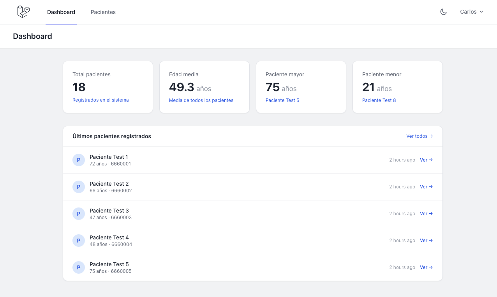
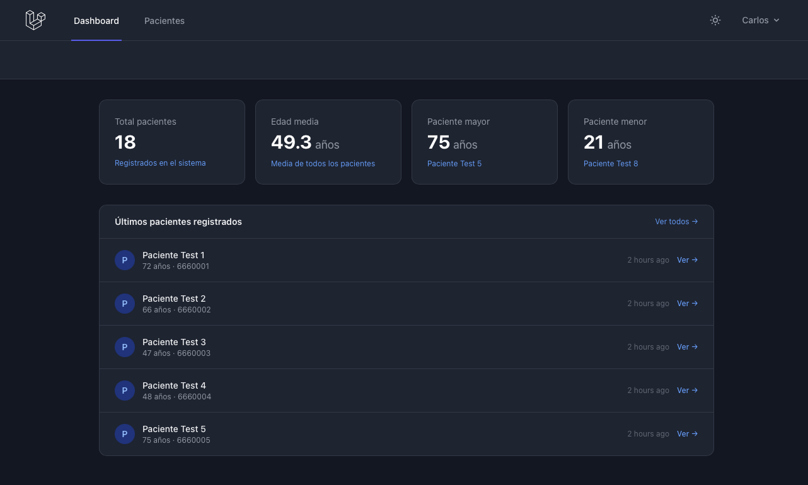

# Gestión Médica — Laravel App

A full-stack web application for managing medical center patients, built with Laravel 12 and Tailwind CSS.

🔗 **Live demo:** _coming soon_

---

## Features

- **Patient management** — full CRUD: create, view, edit and delete patients
- **Patient detail page** — individual profile with all patient data
- **Clinical notes** — add and delete clinical notes per patient
- **Appointment history** — schedule appointments with date, time, reason and doctor. Update status (pending / completed / cancelled) directly from the card
- **Search & pagination** — real-time patient search with paginated results
- **Dashboard** — statistics overview: total patients, average age, oldest/youngest patient, recently registered
- **Dark mode** — stored per user in the database, persists across devices and sessions
- **Export** — download patient list as CSV or PDF
- **Form validation** — server-side validation with inline error messages
- **Flash messages** — success confirmations after every action
- **Confirmation modals** — elegant delete dialogs (no browser alerts)
- **Authentication** — login, register and profile management via Laravel Breeze

---

## Tech stack

| Layer | Technology |
|---|---|
| Framework | Laravel 12 |
| Frontend | Blade templates, Tailwind CSS, Vite |
| Auth | Laravel Breeze |
| PDF export | barryvdh/laravel-dompdf |
| Database | SQLite (dev) |
| Language | PHP 8.5 |

---

## Screenshots

### Dashboard


### Patient list


### Patient detail with clinical notes and appointments


### Dark mode


### Delete confirmation modal


---

## Running locally

```bash
# Clone the repo
git clone https://github.com/domin10/gestion-medica.git
cd gestion-medica

# Install PHP dependencies
composer install

# Install JS dependencies
npm install

# Set up environment
cp .env.example .env
php artisan key:generate

# Run migrations
php artisan migrate

# Start the dev server (two terminals)
php artisan serve
npm run dev
```

Then open [http://127.0.0.1:8000](http://127.0.0.1:8000) and register an account.

---

## Project structure

```
app/
├── Http/Controllers/
│   ├── PacienteController.php   # Patients CRUD + notes + appointments + export
│   └── DashboardController.php  # Statistics
└── Models/
    ├── Paciente.php              # hasMany: notes, appointments
    ├── Nota.php                  # belongsTo: patient
    └── Cita.php                  # belongsTo: patient

database/migrations/
├── create_pacientes_table.php
├── create_notas_table.php
├── create_citas_table.php
└── add_dark_mode_to_users_table.php

resources/views/
├── layouts/                      # Breeze layout + navigation
├── components/                   # Reusable Blade components
├── pacientes/                    # Patient views (index, show, crear, editar)
├── exports/                      # PDF template
└── dashboard.blade.php

routes/
└── web.php                       # All application routes
```

---

## Key concepts demonstrated

- **Eloquent ORM** — models, relationships (hasMany / belongsTo), eager loading with `with()`
- **Migrations** — schema definition, foreign keys with cascade delete
- **Blade components** — reusable UI components, layouts with `@yield` / `$slot`
- **Form validation** — `$request->validate()` with custom error messages
- **Authentication** — Laravel Breeze with user preferences stored in DB
- **File export** — CSV via `response()->stream()`, PDF via DomPDF
- **Dark mode** — class-based Tailwind dark mode, preference saved per user
- **Flash messages** — session-based success notifications
- **Query optimization** — eager loading to avoid N+1 queries

---

## Author

**Carlos Domínguez** — Full-Stack Developer
[LinkedIn](https://www.linkedin.com/in/carlos-dominguezs) · [GitHub](https://github.com/domin10) · [AlphaRoom](https://www.alpharoomlab.com)